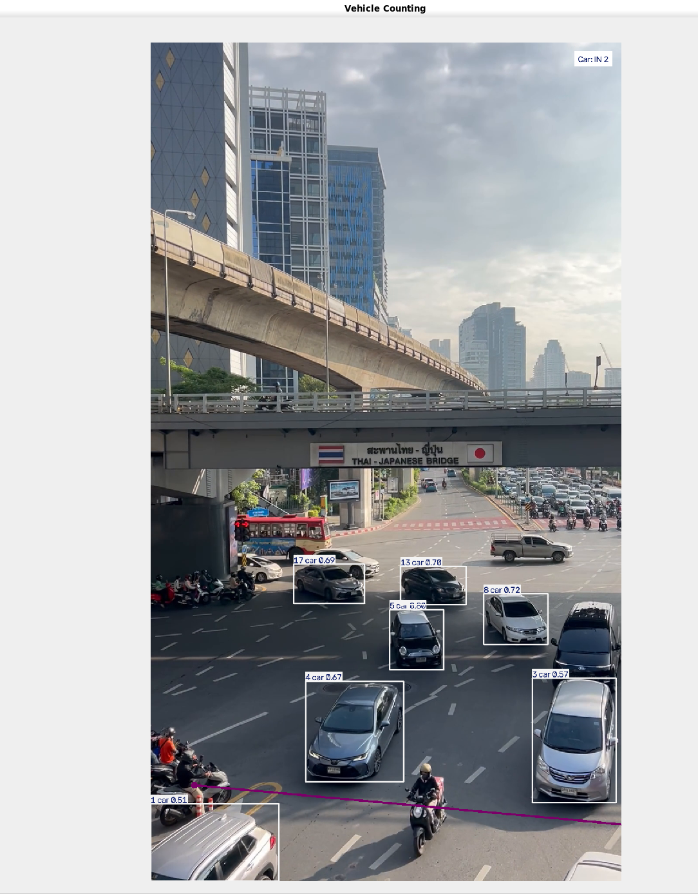

# Vehicle Line Crossing Project

โปรเจกต์นับจำนวนรถที่ข้ามเส้นด้วย YOLO + OpenCV 

  

---

## 1. Concept Crossing Line
`concept-crossingline.py`

แนวคิดเริ่มต้น — จำลองการเคลื่อนที่ของรถด้วยภาพนิ่งบน OpenCV

- วาดเส้นสมมติ แล้วเช็คว่าวัตถุเคลื่อนที่ **ข้ามเส้นแนวนอน** หรือไม่
- เงื่อนไข: `prev_y < line_y` และ `curr_y >= line_y`

## 2. Custom Solution
`custom-soltion.py`

เขียนฟังก์ชันคำนวณเองทั้งหมด รองรับเส้นเฉียงด้วย **Cross Product**

- เก็บพิกัดเปรียบเทียบ 2 เฟรม: `prev_point` ↔ `curr_point`
- ใช้ Cross Product เช็คว่าจุดอยู่ฝั่งไหนของเส้น (รองรับเส้นเฉียง ไม่จำกัดแค่แนวนอน)
- ใช้ `Set` เก็บ `track_id` เพื่อกันการนับซ้ำ

## 3. Ultralytics Solution
`solution-from-ultralytics.py`

ใช้ฟังก์ชันสำเร็จรูปจากไลบรารี **Ultralytics** (`solutions.ObjectCounter`)

- จัดการ Detection + Tracking + Line Crossing ให้ครบในตัว
- ไม่ต้องเขียน Logic เอง เหมาะกับการใช้งานจริง/รวดเร็ว

